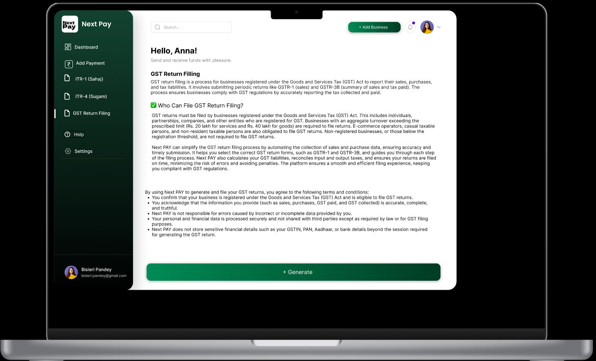

# Multi-Tenant Payroll & Tax Compliance System

## Introduction

The **Multi-Tenant Payroll & Tax Compliance System** automates tax filings, payroll management, and compliance for multiple tenants (businesses/users). It simplifies **ITR-1 (Sahaj), ITR-2 (Sugam), and GST return filing**, streamlines payments, enhances user management, and tracks transactions. By leveraging **Gemini AI**, the system automates complex tasks, minimizes errors, and intelligently optimizes tax savings.

## Figma Prototype

Explore the interactive design prototype here: https://www.figma.com/proto/Q897qPu0feZhwH4dOUJIpl/next-payroll-final?node-id=102-12&t=gzZkW21oc463V5WK-1

## Key Features & Use Cases

* **Payroll Processing:** Automates salary disbursement, calculates tax deductions, and generates detailed payslips.
* **Intelligent Tax Filing:**
    * **ITR-1 (Sahaj):** Designed for individuals with income from salary, one house property, and other sources (e.g., interest).
    * **ITR-2 (Sugam):** Suitable for individuals and HUFs (Hindu Undivided Families) with more complex income sources like capital gains, and who do not have income from business or profession.
    * **GST Return Filing:** Simplifies GST return submission and ensures compliance automation.
* **Payments & Transactions:** Tracks all income and expenses, enabling the generation of comprehensive financial reports.
* **AI-Powered Tax Assistant:** Leverages Gemini AI to automate tax calculations, provide personalized tax-saving recommendations, and detect financial anomalies.
* **Multi-Tenant Support:** Offers robust role-based access control for different user types, including business owners/users, accountants, and administrators, ensuring data isolation and secure management for each tenant.

## Why This System Excels

<table>
  <thead>
    <tr>
      <th>Feature</th>
      <th>Existing Solutions</th>
      <th>Our System</th>
    </tr>
  </thead>
  <tbody>
    <tr>
      <td><b>Multi-Tenancy</b></td>
      <td>Limited / Single-user</td>
      <td>Full support for multiple businesses/users</td>
    </tr>
    <tr>
      <td><b>Automated Tax Filing</b></td>
      <td>Manual effort</td>
      <td>AI-powered automation and smart form filling</td>
    </tr>
    <tr>
      <td><b>AI-Powered Insights</b></td>
      <td>No AI assistance</td>
      <td>AI-driven tax recommendations & anomaly detection</td>
    </tr>
    <tr>
      <td><b>Processing Speed</b></td>
      <td>Slow, prone to errors</td>
      <td>Fast, scalable with efficient Supabase operations</td>
    </tr>
    <tr>
      <td><b>Scalability</b></td>
      <td>Limited</td>
      <td>Cloud-ready, serverless infrastructure for growth</td>
    </tr>
  </tbody>
</table>

## Technology Stack

* **Frontend:** **Next.js** (for robust, SEO-friendly applications with Server-Side Rendering) + **Tailwind CSS** (for rapid, utility-first styling)
* **Backend:** **Supabase** (an open-source, scalable Backend-as-a-Service, providing database, authentication, and APIs)
* **AI Integration:** **Gemini AI** (for advanced tax automation, conversational chatbot capabilities, and anomaly detection)
* **Authentication & Security:** **Supabase Auth** (for secure, JWT-based authentication and API security)

## System Architecture & Scalability

Our system is built on a modern, cloud-native architecture designed for performance and scalability:

* **Frontend (Next.js):** Provides the intuitive user dashboard and data visualization interface.
* **Backend (Supabase):** Manages user authentication, payroll computations, and transaction processing.
* **Database (Supabase):** Securely stores all multi-tenant data, payment records, and tax filing information.
* **AI Module (Gemini AI):** Integrates seamlessly to automate complex tax calculations and optimize deductions.

This modular setup ensures high availability, easy maintenance, and the ability to scale efficiently as your user base grows.

## Visual Walkthrough

Get a quick glimpse of the Multi-Tenant Payroll & Tax Compliance System in action:

* **Dashboard Overview**
    

* **Payroll Processing Interface**
    

* **Payment Sucessful**
    
* **GST Return Filling**


## Advantages & Future Scopes

### Advantages

* Significantly faster tax processing with advanced AI automation.
* Robust multi-tenant support catering to various businesses and accounting firms.
* AI-powered insights for intelligent tax optimization and financial anomaly detection.
* Scalable, cloud-based architecture ensures reliable performance and future growth.

### Future Scopes

* Regular updates to ensure compliance with evolving tax laws and regulations.
* Potential for offline support to enhance accessibility and user experience.
* Integration with a wider array of payment gateways for greater flexibility.
* Development of advanced reporting and analytics features for deeper financial insights.
* Expansion of AI capabilities to handle even more complex tax scenarios and predictive analytics.

## Database Schema (Supabase)

Below is an overview of the core database tables:

### `users` Table

<table>
  <thead>
    <tr>
      <th>Column</th>
      <th>Type</th>
      <th>Constraints</th>
      <th>Description</th>
    </tr>
  </thead>
  <tbody>
    <tr>
      <td><code>id</code></td>
      <td><code>UUID</code></td>
      <td><code>PRIMARY KEY</code></td>
      <td>Unique identifier for each user</td>
    </tr>
    <tr>
      <td><code>email</code></td>
      <td><code>VARCHAR</code></td>
      <td><code>UNIQUE</code>, <code>NOT NULL</code></td>
      <td>User's email address (login ID)</td>
    </tr>
    <tr>
      <td><code>password</code></td>
      <td><code>VARCHAR</code></td>
      <td><code>NOT NULL</code></td>
      <td>Hashed password</td>
    </tr>
    <tr>
      <td><code>role</code></td>
      <td><code>VARCHAR</code></td>
      <td><code>DEFAULT 'admin'</code></td>
      <td>User's role (e.g., 'admin', 'business', 'accountant')</td>
    </tr>
    <tr>
      <td><code>created_at</code></td>
      <td><code>TIMESTAMP</code></td>
      <td><code>DEFAULT CURRENT_TIMESTAMP</code></td>
      <td>Timestamp of user creation</td>
    </tr>
  </tbody>
</table>

### `businesses` Table (One-to-One with Users)

<table>
  <thead>
    <tr>
      <th>Column</th>
      <th>Type</th>
      <th>Constraints</th>
      <th>Description</th>
    </tr>
  </thead>
  <tbody>
    <tr>
      <td><code>id</code></td>
      <td><code>UUID</code></td>
      <td><code>PRIMARY KEY</code></td>
      <td>Unique identifier for each business</td>
    </tr>
    <tr>
      <td><code>name</code></td>
      <td><code>VARCHAR</code></td>
      <td><code>NOT NULL</code></td>
      <td>Name of the business</td>
    </tr>
    <tr>
      <td><code>owner_id</code></td>
      <td><code>UUID</code></td>
      <td><code>FOREIGN KEY</code> → <code>users(id)</code>, <code>NOT NULL</code></td>
      <td>Foreign key linking to the owner's user ID</td>
    </tr>
    <tr>
      <td><code>created_at</code></td>
      <td><code>TIMESTAMP</code></td>
      <td><code>DEFAULT CURRENT_TIMESTAMP</code></td>
      <td>Timestamp of business record creation</td>
    </tr>
  </tbody>
</table>

### `transactions` Table

<table>
  <thead>
    <tr>
      <th>Column</th>
      <th>Type</th>
      <th>Constraints</th>
      <th>Description</th>
    </tr>
  </thead>
  <tbody>
    <tr>
      <td><code>id</code></td>
      <td><code>UUID</code></td>
      <td><code>PRIMARY KEY</code></td>
      <td>Unique identifier for each transaction</td>
    </tr>
    <tr>
      <td><code>user_id</code></td>
      <td><code>UUID</code></td>
      <td><code>FOREIGN KEY</code> → <code>users(id)</code>, <code>ON DELETE SET NULL</code></td>
      <td>User associated with the transaction (can be null if user is deleted)</td>
    </tr>
    <tr>
      <td><code>business_id</code></td>
      <td><code>UUID</code></td>
      <td><code>FOREIGN KEY</code> → <code>businesses(id)</code>, <code>ON DELETE SET NULL</code></td>
      <td>Business associated with the transaction (can be null if business is deleted)</td>
    </tr>
    <tr>
      <td><code>amount</code></td>
      <td><code>DECIMAL</code></td>
      <td><code>NOT NULL</code></td>
      <td>Transaction amount</td>
    </tr>
    <tr>
      <td><code>category</code></td>
      <td><code>VARCHAR</code></td>
      <td><code>NOT NULL</code></td>
      <td>Category of the transaction (e.g., 'Salary', 'Rent', 'Utilities')</td>
    </tr>
    <tr>
      <td><code>transaction_type</code></td>
      <td><code>VARCHAR</code></td>
      <td><code>CHECK ('income' OR 'expense')</code></td>
      <td>Type of transaction (income or expense)</td>
    </tr>
    <tr>
      <td><code>created_at</code></td>
      <td><code>TIMESTAMP</code></td>
      <td><code>DEFAULT CURRENT_TIMESTAMP</code></td>
      <td>Timestamp of transaction creation</td>
    </tr>
  </tbody>
</table>

### `tax_filings` Table

<table>
  <thead>
    <tr>
      <th>Column</th>
      <th>Type</th>
      <th>Constraints</th>
      <th>Description</th>
    </tr>
  </thead>
  <tbody>
    <tr>
      <td><code>id</code></td>
      <td><code>UUID</code></td>
      <td><code>PRIMARY KEY</code></td>
      <td>Unique identifier for each tax filing</td>
    </tr>
    <tr>
      <td><code>user_id</code></td>
      <td><code>UUID</code></td>
      <td><code>FOREIGN KEY</code> → <code>users(id)</code>, <code>ON DELETE CASCADE</code></td>
      <td>User who initiated the filing</td>
    </tr>
    <tr>
      <td><code>filing_type</code></td>
      <td><code>VARCHAR</code></td>
      <td><code>CHECK ('ITR-1', 'ITR-2', 'GST')</code></td>
      <td>Type of tax filing (e.g., ITR-1, GST)</td>
    </tr>
    <tr>
      <td><code>status</code></td>
      <td><code>VARCHAR</code></td>
      <td><code>CHECK ('pending', 'submitted', 'approved')</code></td>
      <td>Current status of the filing</td>
    </tr>
    <tr>
      <td><code>submitted_at</code></td>
      <td><code>TIMESTAMP</code></td>
      <td><code>NULLABLE</code></td>
      <td>Timestamp when the filing was submitted</td>
    </tr>
  </tbody>
</table>

### `metadata` Table

<table>
  <thead>
    <tr>
      <th>Column</th>
      <th>Type</th>
      <th>Constraints</th>
      <th>Description</th>
    </tr>
  </thead>
  <tbody>
    <tr>
      <td><code>id</code></td>
      <td><code>UUID</code></td>
      <td><code>FOREIGN KEY</code> → <code>tax_filings(id)</code></td>
      <td>Foreign key linking to a tax filing record</td>
    </tr>
    <tr>
      <td><code>user_id</code></td>
      <td><code>UUID</code></td>
      <td><code>FOREIGN KEY</code> → <code>users(id)</code>, <code>ON DELETE CASCADE</code></td>
      <td>User associated with this metadata</td>
    </tr>
    <tr>
      <td><code>url</code></td>
      <td><code>VARCHAR</code></td>
      <td><code>NOT NULL</code></td>
      <td>URL to an associated document (e.g., PDF of a payslip)</td>
    </tr>
  </tbody>
</table>

## Installation & Setup

### Prerequisites

* A **Supabase account** with your project configured.
* **Node.js** (LTS version recommended) and **npm** installed on your local machine.

### Clone the Repository

```bash
git clone [https://github.com/sristy17/next-payroll.git](https://github.com/sristy17/next-payroll.git)
cd multi-tenant-payroll-tax-system
Install Dependencies
Navigate to the project directory and install the required npm packages:

Bash

npm install
Setup Environment Variables
Create a .env file in the root of your project directory. Add your Supabase API keys to this file. Remember that for Next.js, environment variables intended for client-side use must be prefixed with NEXT_PUBLIC_.

NEXT_PUBLIC_SUPABASE_URL=[https://akcuqzqsubmwzydpdikp.supabase.co](https://akcuqzqsubmwzydpdikp.supabase.co)
NEXT_PUBLIC_SUPABASE_ANON_KEY=your_supabase_anon_key
Note: A sample .env.example file is included in the repository. You can duplicate it, rename it to .env, and then replace the placeholder credentials with your actual Supabase API keys. Do not commit your .env file to version control.

Run the Application
Start the development server to run the application locally:

Bash

npm run dev
The application should now be accessible in your web browser, typically at http://localhost:3000.

License
This project is licensed under the MIT License.